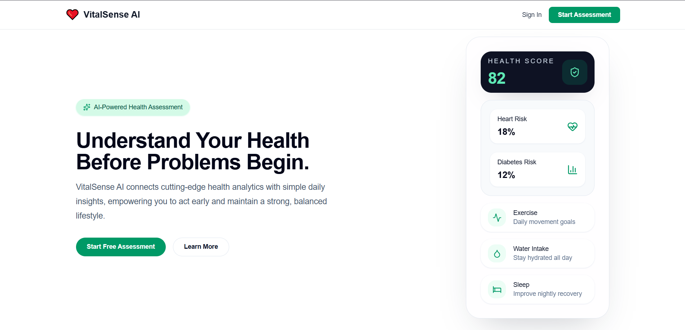
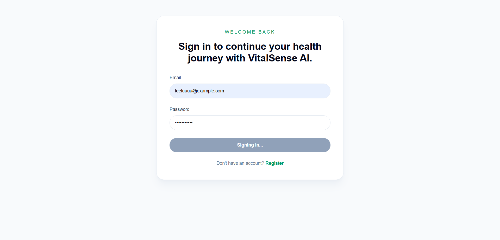
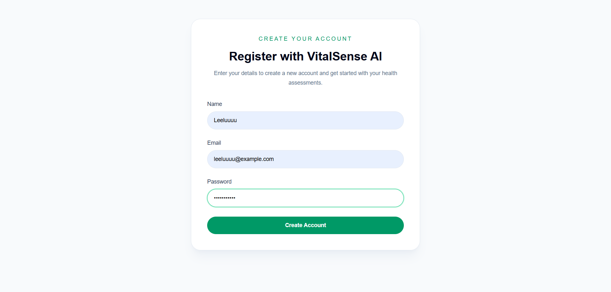
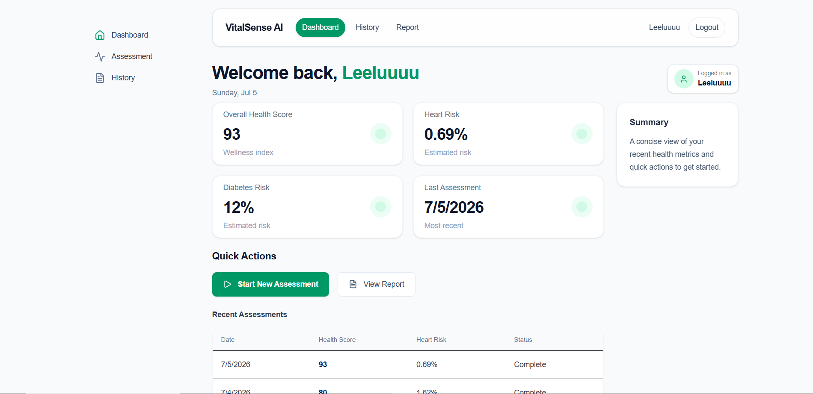
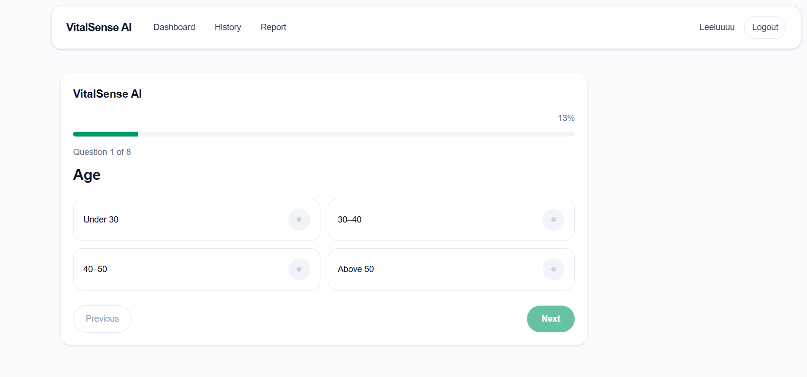
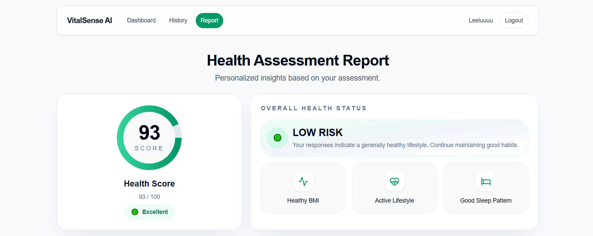
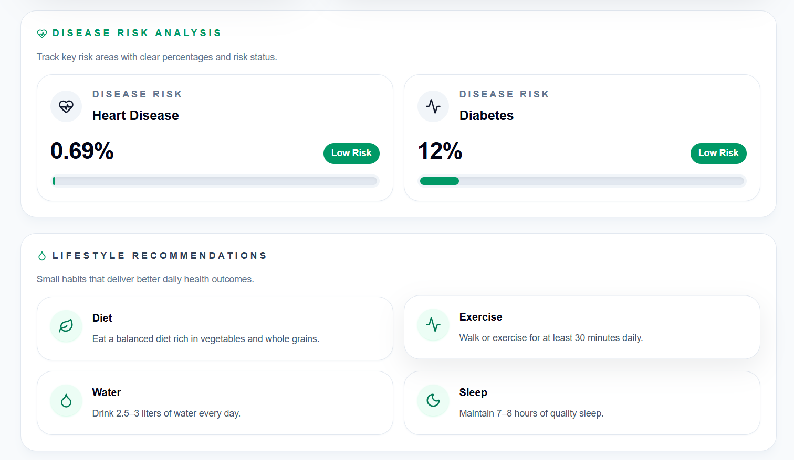
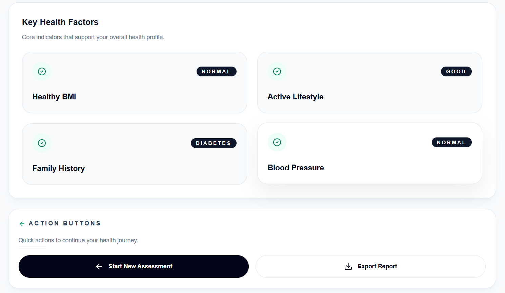
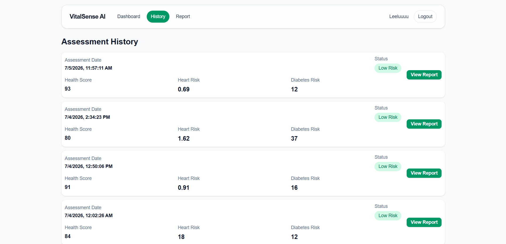

# 🩺 VitalSense AI

An AI-powered Health Risk Assessment platform that predicts heart disease and diabetes risk using Machine Learning while providing personalized health insights through an interactive dashboard.

---

## 🌐 Live Demo

Frontend: https://vitalsense-frontend-szct.onrender.com

Backend API: https://vitalsense-ai-zpku.onrender.com

---

## 📖 Project Overview

VitalSense AI is a full-stack AI-powered healthcare web application that helps users assess their potential risk of heart disease and diabetes through an interactive health questionnaire.

The application uses Machine Learning models to analyze user inputs and generate:
- Personalized Health Score
- Heart Disease Risk
- Diabetes Risk
- Lifestyle Recommendations
- Assessment History

The project is designed to demonstrate modern full-stack development by combining a responsive frontend, secure backend APIs, cloud database integration, and AI-powered predictions into a single application.

---

## ✨ Features

### 🔐 Authentication
- User Registration
- Secure Login
- JWT Authentication
- Protected Routes

### 🩺 Health Assessment
- Interactive Health Questionnaire
- AI-powered Health Analysis
- Heart Disease Risk Prediction
- Diabetes Risk Prediction

### 📊 Dashboard
- Personalized Health Score
- Recent Assessment Overview
- Quick Navigation
- User Summary

### 📄 Reports
- Overall Health Analysis
- Disease Risk Breakdown
- Lifestyle Recommendations
- Health Factors

### 📚 Assessment History
- View Previous Assessments
- Track Health Progress
- Access Past Reports

### ☁️ Deployment
- Frontend hosted on Render
- Backend hosted on Render
- PostgreSQL Database on Neon

---

## 🛠️ Tech Stack

### Frontend
- Next.js
- React
- TypeScript
- Tailwind CSS
- Axios

### Backend
- Node.js
- Express.js
- Prisma ORM
- JWT Authentication
- Zod Validation

### Database
- PostgreSQL
- Neon Database

### Machine Learning
- Python
- Scikit-learn

### Deployment
- Render (Frontend)
- Render (Backend)
- Neon PostgreSQL

---

## 📂 Project Structure

```text
VitalSense-AI/
│
├── client/                 # Next.js frontend
│   ├── app/
│   ├── components/
│   ├── lib/
│   └── services/
│
├── backend/                # Express.js backend
│   ├── prisma/
│   ├── src/
│   │   ├── controllers/
│   │   ├── routes/
│   │   ├── services/
│   │   └── server.ts
│   └── ml/                 # Machine Learning models
│
├── README.md
└── package.json
```

---

## ⚙️ Installation & Setup

### 1️⃣ Clone the Repository

```bash
git clone https://github.com/puppalaleelaprasanna5-ux/vitalsense-ai.git
cd VitalSense-AI
```

---

### 2️⃣ Backend Setup

```bash
cd backend
npm install
```

Create a `.env` file inside the **backend** folder and add:

```env
PORT=5000
DATABASE_URL=your_database_url
JWT_SECRET=your_jwt_secret
```

Run the backend:

```bash
npm run dev
```

---

### 3️⃣ Frontend Setup

Open a new terminal:

```bash
cd client
npm install
```

Create a `.env.local` file inside the **client** folder:

```env
NEXT_PUBLIC_API_URL=http://localhost:5000/api
```

Run the frontend:

```bash
npm run dev
```

---

### 4️⃣ Open the Application

Visit:

```
http://localhost:3000
```

---

## 📸 Screenshots

### 🏠 Landing Page



---

### 🔐 Login



---

### 📝 Register



---

### 📊 Dashboard



---

### 🩺 Health Assessment



---

### 📄 Health Report

#### Report Overview



#### Disease Risk Analysis



#### Lifestyle Recommendations



---

### 📚 Assessment History



---

## 🚀 Future Improvements

- 📱 Mobile Application (React Native / Flutter)
- 🤖 AI Chatbot for Personalized Health Guidance
- 📈 Advanced Health Analytics Dashboard
- ⌚ Integration with Wearable Devices
- 📄 Downloadable PDF Health Reports
- 🔔 Health Reminder Notifications
- 🧬 Support for Additional Disease Predictions
- 🌐 Multi-language Support

---

## 👨‍💻 Author

**Leela Prasanna**

- 🎓 B.Tech - Artificial Intelligence & Machine Learning
- 💻 Passionate about Full Stack Development & AI
- 🔗 GitHub: https://github.com/puppalaleelaprasanna5-ux

---

## 📄 License

This project is created for educational and portfolio purposes.

Feel free to explore the code, learn from it, and build upon it for your own projects.